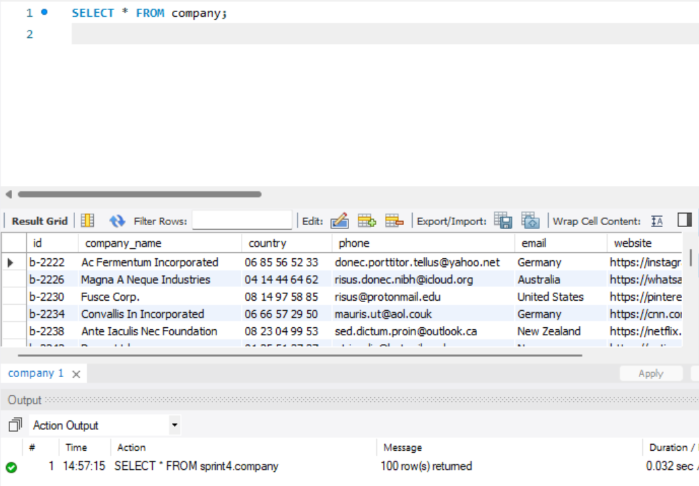

# Bones pràctiques de SQL

Aquest document recull les principals recomanacions per a la redacció, presentació i justificació de consultes SQL en el marc de les entregues de l'especialitat de Data Analytics d'IT Academy.

## Presentació de les consultes

Per a cada consulta lliurada:

- Has d'assegurar-te de mostrar mitjançant una captura de pantalla tres elements:

    - **La query (consulta)**: en el bloc de codi SQL.
    - **El Results Grid**: la taula amb els resultats que retorna la consulta.
    - **L’Action Output**: on es mostra el nombre de files afectades i possibles errors.

    Com l’exemple que et mostrem a continuació:

    

    Aquests tres elements han d’anar en cada resposta de les pràctiques en un sol PDF. 

- Si lliures diverses solucions, només es corregirà la primera que aparegui. Tria la més adequada i, si ho desitges, pots justificar per què descartes les altres.

- Justifica només si consideres que has pres una decisió poc evident, per exemple: "utilitzo subconsulta perquè em permet...", "prefereixo aquesta funció per...", "selecciono les transaccions no declinades per...".

## Recomanacions tècniques en SQL

### Estil i llegibilitat

- Utilitza majúscules per a les paraules reservades de SQL (``SELECT``, ``JOIN``, ``WHERE``, ``GROUP BY``...).
- Utilitza minúscules per als noms de taules i columnes (company_id, transaction_date, etc.).
- Fes servir sagnats i salts de línia perquè la consulta sigui llegible.
- Assigna àlies a les taules (`c`, `t`, `u`...) i mantingues l’ús d’aquests àlies de manera consistent a tota la query.
- Tria àlies i noms de columnes calculades clars i sense espais (`total_ventas`, `media_gasto`).
- Mantingues el mateix idioma durant tota la consulta.

### Consultes i estructures

- Evita subconsultes si l’enunciat no les exigeix. Prefereix `JOIN` per rendiment i claredat.
- Si l’enunciat exigeix subconsultes, utilitza-les tot i que puguis fer-ho amb `JOIN`.
- Utilitza `USE nom_bbdd;` al principi de l’script si treballaràs amb una sola base de dades.
- Si utilitzes diverses taules, sigues consistent amb les crides. Tens dues opcions:
    1. Cridar-les sense especificar la taula (`columna`), excepte quan hi hagi coincidència de noms de columnes (`taula.id`).
    2. Cridar-les sempre amb la taula a la qual corresponen (`taula.columna`).

    El que **no s’ha de fer** és combinar-ho: que a vegades afegeixis la taula i a vegades no. Això **no es fa**!

### Operacions

- Si estàs treballant amb diners, arrodoneix a dos decimals amb `ROUND(columna, 2)`, `TRUNCATE(columna, 2)` o `FORMAT(columna, 2)`.
- Utilitza funcions com `STR_TO_DATE`, `DATE_FORMAT`, `LEFT`, `RIGHT`, `CAST`, `CONCAT`, segons el que se’t demani per manipular o transformar les dades.
- Controla l’ús de `CASCADE`. Només s’ha d’utilitzar si té sentit eliminar en cascada (com factures i les seves línies) i si tens control absolut de la base de dades.

### Fitxers .SQL portables

Lliura el teu fitxer `.sql` de manera que, si s’executa en un altre ordinador, reprodueixi el mateix entorn:

- Crea la base de dades.
- Utilitza `DROP IF EXISTS` per evitar errors si ja existeix.
- Inclou la creació de taules.
- Inclou els `INSERT INTO`, càrregues des d’arxius o almenys un comentari amb `-- ` indicant que en aquell punt s’ha d’executar un `.sql`.
- Inclou totes les consultes de la teva pràctica.

### Recomanacions addicionals

- No utilitzis mai `SET FOREIGN_KEY_CHECKS = 0`. Això desactiva la integritat referencial i pot ocultar errors greus.
- Evita `IN` o `LIKE` si pots fer servir `=`, `EXISTS` o `JOIN`. `IN` pot ser més costós o ambigu en alguns casos.
- Evita utilitzar `SET SQL_SAFE_UPDATES = 0` com a solució ràpida per evitar restriccions de seguretat. Aquest mode protegeix la base de dades d’actualitzacions o eliminacions massives no desitjades. En lloc d’això, assegura’t que les teves consultes `DELETE` o `UPDATE` incloguin una clàusula `WHERE` ben definida i, si cal, un `LIMIT`.

Tingues en compte que, de vegades, encara que facis servir `WHERE`, MySQL pot mantenir el mode segur si la condició no inclou una clau primària o un filtre prou específic. És recomanable fer servir identificadors únics (com l’id de la fila) per garantir que la consulta sigui segura i passi les restriccions del mode segur.

### Eines recomanades per complementar

- A Workbench: *Database → Reverse Engineer o Models → Create EER Model from Database*: per mostrar el diagrama o model de la base de dades.
- [Draw.io](https://app.diagrams.net/) per representar esquemes EER.
- YouTube: [STR_TO_DATE()](https://www.youtube.com/watch?v=z2_8cYcxfwg) explicat.