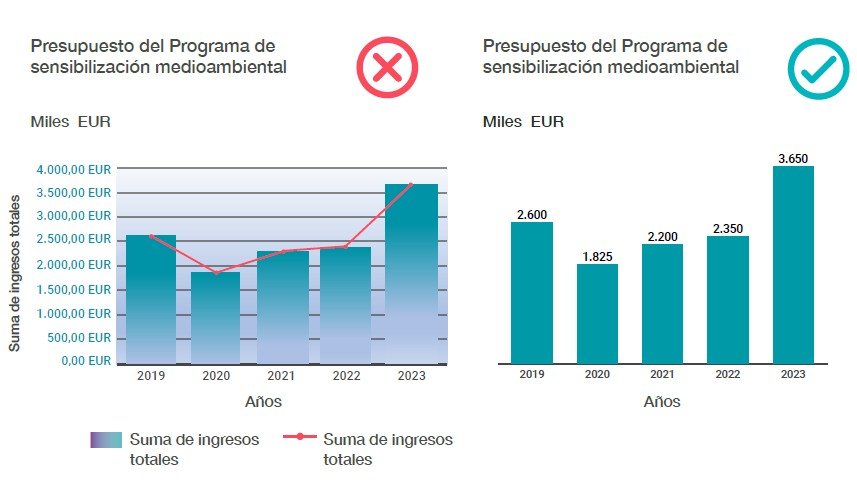
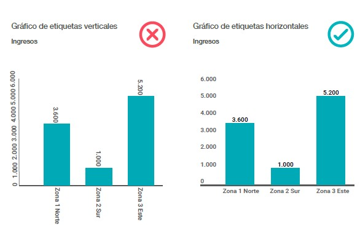
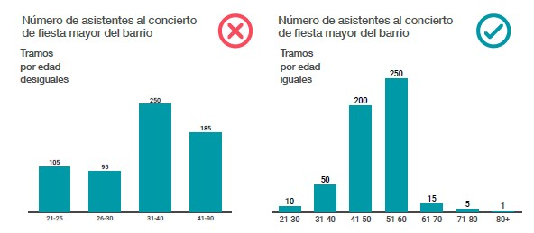
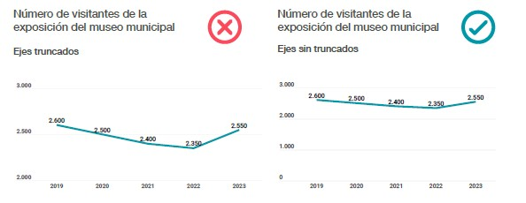
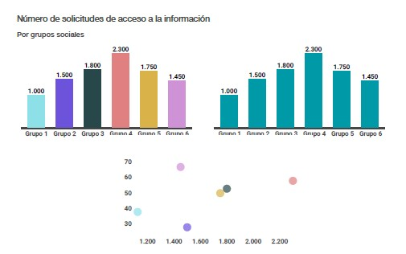

# Bones pràctiques de visualització.

## Introducció
En el món de l’analítica de dades, saber extreure informació útil no és suficient: cal també comunicar-la de manera clara, efectiva i responsable. Aquesta guia està pensada per ajudar-te a dominar els principis i les bones pràctiques de la visualització de dades, una competència fonamental per a qualsevol analista.

L’objectiu és doble: d’una banda, oferir-te eines per crear visualitzacions que facilitin la comprensió i la presa de decisions; de l’altra, acostar-te a un model estandarditzat que pot ser útil especialment en el context de les entitats públiques i locals, on la claredat i la transparència són essencials.

A més, aquesta guia promou valors com la qualitat, la simplicitat, la inclusió i l’ètica, perquè comunicar dades no és només una qüestió tècnica, sinó també una responsabilitat social. Aprendràs a fer servir els recursos visuals adequats, a evitar errors comuns i a dissenyar visualitzacions que realment comuniquin.

## Principis generals de visualització de dades

La visualització de dades ens ajuda a analitzar, entendre i comunicar missatges basats en dades. A diferència d’altres formes de comunicació, com poden ser el llenguatge escrit o la música, la visualització de dades no disposa de criteris ni regles universals de notació i representació semàntica.

Tot i això, hi ha una sèrie de principis àmpliament acceptats i formes de representar les dades que els usuaris reconeixen i poden percebre de manera efectiva i entenedora.

En aquest sentit, cal destacar les aportacions de l’International Business Communication Standards (IBCS), que treballa per unificar la visualització d’informació financera. Igualment, són molt rellevants les contribucions de diversos organismes públics —com l’Institut Nacional d’Estadística, la Generalitat de Catalunya o el portal datos.gob.es, entre d’altres—, que, a través de la publicació de guies i recursos propis, impulsen principis i bones pràctiques de visualització àmpliament reconegudes.

## Principis habituals en l’àmbit de la visualització

En la guia s’han seleccionat vuit principis habituals en l’àmbit de la visualització de dades, que es resumeixen a continuació:

1. Simplificació

2. Percepció fidel

3. Aprofitament de l’espai

4. Estructuració correcta

5. Objectivitat i compliment ètic i normatiu

6. Uniformitat

7. Ús adequat del color

8. Accessibilitat i disseny inclusiu

## 1. Principi de simplificació

Aquest principi, conegut com "Simplifica i evita el desordre" (Simplify and avoid clutter), planteja la necessitat que les visualitzacions siguin simples i clares, eliminant tots aquells elements superflus, decoratius, excessivament complexos o redundants que puguin dificultar la comprensió del missatge principal.

L’objectiu és millorar la claredat i l’eficiència comunicativa de la visualització, augmentant la proporció d’informació rellevant respecte a la quantitat de tinta utilitzada. En altres paraules, s’ha de prioritzar la informació essencial i evitar la saturació visual.

**S’han de seguir aquestes recomanacions bàsiques:**
- Evitar elements decoratius o innecessaris, com ara logotips, fotografies, animacions, fons amb trames o textures, efectes 3D, ombres, colors decoratius o tipografies ornamentals.
- Utilitzar colors només amb propòsit, per destacar o diferenciar. L’excés de color pot confondre.
- Preferir el contrast alt i net, com xifres negres sobre fons blanc.
- Reduir el soroll visual: eliminar línies de quadrícula, línies de separació innecessàries en taules, vores i etiquetes supèrflues.
- Simplificar el text: eliminar paraules redundants o evidents (com "gràfic", "taula", "suma", etc.).
- Ajustar les xifres mostrades, evitant decimals innecessaris i etiquetes en valors baixos; cal arrodonir si no es perd significat.

**Exemple d’aplicació del principi de simplificació: Els dos gràfics següents mostren exactament la mateixa sèrie de dades, però en el de la dreta, la comprensió de les dades és més ràpida, eficient i precisa.**

**Dèficits identificats en el gràfic de l’esquerra:**
- Els decimals i la repetició de "EUR" en les etiquetes de dades no aporten valor i dificulten la lectura. A més, el color blau de les etiquetes no facilita la percepció.

- Els títols inclouen paraules innecessàries, com ara “anys”, “totals” i “suma”.

- S’incorporen llegendes que no són útils per a la comprensió del gràfic.

- La rotulació de l’eix vertical és prescindible, i el fet que el rètol estigui en sentit vertical en dificulta la lectura.

- El degradat decoratiu i les línies de les barres són elements superflus que generen distracció.

- Es combinen un gràfic de barres i un de línies per a la mateixa sèrie de dades, la qual cosa és redundant i no aporta informació addicional.

- No s’incorporen etiquetes de valor a cada barra, cosa que obliga a l’usuari a fer una traslació visual des de l’eix fins a cada barra.

- Amb la inclusió de les etiquetes de valor, es pot eliminar l’eix Y, ja que en aquest cas no aporta gaire utilitat.

- Les línies horitzontals de projecció de valors (grid) són totalment prescindibles.

- El fons de color gris no és necessari i dificulta la visualització de les etiquetes.

## 2. Principi de percepció fidel

La representació de les dades ha d’oferir una imatge fidel de la realitat, que faciliti el coneixement objectiu i complet de les dades i eviti que la persona usuària pugui obtenir interpretacions esbiaixades o parcials.

Les regles associades a aquest principi són:
- Representar les etiquetes de valors i eixos sempre horitzontalment. Les etiquetes verticals o inclinades dificulten molt la lectura de les dades.

Figura 2. Exemple del principi de percepció fidel

- Evitar trams amb composicions desiguals. Agrupar els valors numèrics en categories permet convertir dades numèriques en qualitatives, però mostrar agrupacions amb segments desiguals pot generar interpretacions allunyades de la realitat. En cas que existeixi una categoria residual amb molt poca freqüència, es pot establir un tram més ampli, sempre que l’agrupació no alteri les conclusions de l’anàlisi i s’indiqui degudament com a “resta de valors”.

> **Exemple d’agrupacions desiguals:**  
> Els gràfics següents mostren les mateixes dades, però els missatges es poden interpretar com a contradictoris. En el primer cas, les agrupacions desiguals promouen una falsa acumulació en els grups de més edat. El segon gràfic, amb agrupacions iguals, permet visualitzar una major concentració de casos en les agrupacions d’edat inferiors.
>
> Aquesta falsa percepció es produeix per l’agrupació dels joves en intervals d’edat amb pocs anys de diferència i els de més edat en grups que incorporen un espectre d’edat més ampli.

Figura 3. Exemple d’agrupació de les dades en trams

- Evitar truncar els eixos (que no comencin en zero). Els eixos truncats generen una percepció distorsionada de les proporcions, afavorint una interpretació errònia de les pendents de creixement i decreixement.
El truncament dels eixos és una pràctica habitual que s’aplica quan els gràfics mostren un gran espai buit entre el zero i els primers valors de les sèries. El truncament condensa les dimensions d’un gràfic modificant l’escala d’un eix perquè no comenci en zero, sinó en un valor més proper als valors de les sèries.

>**Exemple de truncament d’eixos:** 
>
>Els dos gràfics següents mostren exactament la mateixa sèrie de dades, però els missatges que comuniquen són molt diferents. El gràfic amb l’eix vertical truncat afavoreix una interpretació de decreixements pronunciats i un creixement remarcable que no corresponen al patró real de les dades.

Figura 4. Exemple de truncament d’eixos  

Evitar les columnes trencades (broken bars). Les columnes trencades no aporten informació sobre la realitat de les proporcions i generen una percepció errònia a l’hora d’interpretar les dades.

>**Exemple d’eix trencat:**
>
> Els següents gràfics mostren les mateixes dades, però en el gràfic amb columnes trencades s'obté una imatge poc precisa de la proporció visual de la diferència.

Figura 5. Exemple de trencament dels eixos d’un gràfic

- Mostrar de manera exhaustiva la totalitat de les categories. Una visualització en què només aparegui una part de les categories pot portar a pensar que les dades mostrades corresponen a la totalitat del fenomen d’estudi. Per això, és més adequat mostrar els valors de totes les categories, indicant clarament el contingut obert o tancat de cada tram. En cas que algunes categories siguin poc nombroses, es poden agrupar en una categoria residual tipus “altres” o “resta”.

>**Exemple de categories no exhaustives:**
>
>Els gràfics següents mostren el nombre de visitants categoritzat per grups d’edat. El primer gràfic no és exhaustiu i mostra únicament les tres categories més nombroses. La suma d’aquests trams és de 500, una xifra inferior a la real. Aquesta dada no correspon amb la totalitat d’assistents, tal com es mostra en el segon gràfic.

Figura 6. Exemple de categories exhaustives (No exhaustiu)

- Presentar les dades ordenades per valors (rànquing) en ordre descendent és una bona opció per facilitar l’anàlisi i identificar les categories més nombroses de manera ràpida.
- No presentar les dades ordenades per valors (rànquing) quan siguin ordinals (amb un ordre intern ja establert), dades temporals o, en definitiva, dades amb un ordre de presentació lògic. L’ordre de presentació que no sigui de rànquing s’ha de mantenir de manera uniforme en el temps.

>**Exemple d’ordenació de dades amb una seqüència lògica:**
>
>Les dades que tenen un ordre natural, com per exemple els dies de la setmana, s’han de presentar seguint aquesta lògica i no mitjançant un rànquing en ordre descendent.

Figura 7. Exemple de presentació de categories amb un ordre lògic

- Verificar la qualitat i la fiabilitat de la font de dades i el seu tractament, així com valorar prèviament les limitacions i la idoneïtat de les dades.

- L’ordre dels valors als eixos ha de ser de menor a major: de baix a dalt a l’eix Y (vertical) i d’esquerra a dreta a l’eix X (horitzontal).

- No utilitzar el degradat de colors com a únic element per mostrar proporcions. A diferència de les formes geomètriques, el color és un recurs molt menys precís per visualitzar una proporció, ja que costa determinar quan un color blau representa el doble que un altre color blau. Tanmateix, és un recurs molt útil per separar grups o remarcar diferències.

>**Exemple de dificultat en la quantificació de valors a partir dels colors:**
>
>El següent gràfic mostra una quantificació de valors en funció d’aplicar un paràmetre quantitatiu a la intensitat de brillantor de cada color en la mateixa proporció que el valor. És molt més fàcil quantificar proporcions a partir de la longitud de les barres que a partir de les intensitats del color. Tanmateix, no sempre és possible respectar aquest principi. Per exemple, en mapes que inclouen molts polígons, és difícil posar una etiqueta de valor per a cadascuna de les divisions, ja que la mida de la font hauria de ser necessàriament molt petita. En aquest cas, sí que estaria justificat l’ús del color per quantificar diferències.

Figura 8. Exemple de dificultat en la quantificació a partir del color

## 3. Principi d’aprofitament de l’espai

L’aprofitament òptim de l’espai disponible és fonamental per garantir que la visualització sigui clara i eficient. Un ús inadequat de l’espai pot provocar gràfics amb massa buits, elements amuntegats o informació poc llegible.

**Recomanacions per a un bon aprofitament de l’espai:**

La densitat de la informació mostrada ha de ser l’adequada, aprofitant l’espai de manera que faciliti l’atenció i la comprensió correcta del missatge.

- Els gràfics han d’aprofitar al màxim l’espai disponible per mostrar la màxima quantitat d’informació rellevant sense sobrecarregar.
- Una visualització ha de justificar l’espai que ocupa; no té sentit mostrar un gràfic gran amb només dues dades quan una taula o un indicador seria més clar i compacte.
- Incorporar elements visuals de petit format, aplicable tant a gràfics com a altres objectes, com ara filtres d’interacció, botons, etc.
- Incorporar un alt nivell d’informació. Cal evitar visualitzacions que ocupin molt espai i mostrin poques dades.

> **Exemple de visualització poc condensada:**
>
> La visualització de l’esquerra mostra un gràfic de sectors amb dues dades, que ocupa pràcticament mitja pàgina. Aquesta poca informació s’acompanya d’un altre gràfic de barres amb quatre dades addicionals que ocupen l’espai de manera molt ineficient.
> Per contra, la visualització de la dreta mostra la informació de manera més adequada, acompanyada de textos explicatius i aportant dades útils per a la comprensió, en un espai més reduït.

Figura 9. Exemple d’aprofitament de l’espai

Altres regles a tenir en compte en aquest principi d’aprofitament de l’espai són:

- Evitar espais buits. Reduir els marges i la separació entre capçaleres i títols, i en general, els espais morts.

- Optar per visualitzacions compostes (overlay/multi tier charts), per exemple, combinant barres, línies o taules amb mini gràfics (mini bars i sparkline amb escala correcta), i evitar mostrar aquests quadres amb els mateixos gràfics de manera independent i ocupant més espai si no és necessari.

- Utilitzar text dins del mateix gràfic. Contribueix a la correcta comprensió de les dades que el text explicatiu estigui més a prop de l’element al qual es refereix. La lletra ha de ser petita (8-10 punts) i s’han d’aprofitar els espais que deixin els diferents objectes de visualització.

## 4. Principi d’estructuració correcta ##

Una bona visualització no depèn únicament de l’encert dels seus objectes individuals, sinó de la composició de tots aquests elements. Així, la manera com s’estructuren i maqueten els diferents elements no és indiferent.
Les regles per aconseguir una estructuració adequada de la visualització són les següents:

- Estructurar el producte visual exhaustivament i organitzar-lo jeràrquicament a partir d’elements principals que es relacionin amb els elements secundaris o auxiliars. El missatge transmès ha de ser clar i complet a partir d’una estructura lògica.

>**Exemple d’estructura jeràrquica i de contingut exhaustiu:**
>
>La visualització de l’esquerra presenta un dèficit de coherència jeràrquica perquè el titular del gràfic es refereix únicament a un dels dos objectes mostrats. El gràfic del nombre d’assistents no serà coherent amb el títol de tota la composició. D’altra banda, l’afirmació del titular de “nivell molt alt d’ingressos” no queda avalada per les dades, ja que no existeix cap referent de comparació que permeti determinar si els ingressos són molt alts o no ho són.
>Per contra, en la visualització de la dreta existeix coherència amb la jerarquia del títol, no es barregen temàtiques i la informació està avalada per les dades que es mostren.

Figura 10. Exemple d’estructuració jeràrquica

- Dissenyar la pàgina o pantalla tenint en compte els patrons de percepció i atenció previstos dels usuaris per transmetre el missatge de manera òptima. Diversos estudis sobre lectura de pantalla i usabilitat web (patrons visuals F, patrons Z, esquema de Gutenberg, triangle d’or d’eye tracking de Google) conclouen que l’atenció dels usuaris segueix un recorregut visual determinat i que no totes les parts de la pantalla reben la mateixa atenció. Fins i tot, existeix el risc que una part rellevant no sigui llegida.

El patró en Z mostra un recorregut que va de la part superior esquerra a la superior dreta, després fa una diagonal ràpida i finalitza a la zona inferior de la pantalla.

En el patró en F, o en triangle, el recorregut inicial és igual, amb una atenció més intensa a la part superior esquerra, que decreix en intensitat i desplaçament cap a la dreta a mesura que la vista baixa per la pantalla.

Per tot això, és especialment important aprofitar el quadrant superior esquerre de la pàgina per transmetre el missatge i captar l’atenció dels usuaris.

>**Estudi Eye tracking de Google:**
>
>Com a exemple del que s’indica en aquest punt, en la imatge adjunta es mostra un mapa de calor del temps d’atenció en cada zona de la pàgina. Tot i que aquesta atenció depèn del propi disseny de la pàgina, la mida de la font i el contrast dels elements que s’hi mostren, es pot apreciar que de manera natural la zona més calenta de la pantalla està situada al quadrant superior esquerre de la pàgina. Aquest patró, com es pot intuir, seguiria un patró de tipus F o triangle.

Figura 11. Exemple de mapa de calor d’atenció visual

- Indexar jeràrquicament amb enllaços i marcadors els productes visuals amb diferents parts, capítols o pestanyes, de manera que el moviment i la navegabilitat entre els diferents apartats sigui fàcil.

- Evitar la superposició de conceptes i mètriques en una mateixa visualització (overlapping), de manera que s’eviti que alguns elements quedin tapats per altres.

- Indicar la font de les dades, l’actualització i, si escau, la metodologia d’elaboració de les dades al peu de pàgina.

## 5. Principis d’objectivitat i compliment ètic i normatiu ##

Aquests principis aposten per unes visualitzacions de dades elaborades amb fidelitat a la realitat, bona fe en el missatge a transmetre, així com una verificació del compliment normatiu en els diferents àmbits que poden afectar la visualització de dades.

> **Les regles principals són:**
>
>- Cal explicar la realitat del fenomen d’estudi de manera completa, tant si l’evolució és positiva com si és negativa.
>- És necessari incorporar escenaris de comparació que permetin analitzar la realitat i avaluar les dades. Per exemple, objectius que s’han d’assolir, períodes anteriors, altres organitzacions, territoris, etc.
>- Mostrar desviacions respecte a objectius i/o períodes anteriors, tant en situacions d’evolució positiva i de compliment d’objectius, com també en els casos en què l’evolució ha estat negativa i s’han generat desviacions no favorables.
>- Revisar el compliment normatiu, com ara requisits legals, normativa interna o compromisos que poden afectar la visualització. El compliment normatiu pot afectar la confidencialitat, la protecció de dades personals, els drets d’autor i llicències, les imatges i els materials utilitzats o obligacions d’accessibilitat, entre altres.

## 6. Principi d’uniformitat ##

Els usuaris estan habituats a formats de visualització de dades que reconeixen ràpidament. Quan aquests formats no són els habituals, la comprensió és més lenta i es requereix un major esforç visual.

Per garantir que la comprensió sigui ràpida, els formats i anotacions han de ser uniformes.

El principi d’uniformitat proposa mantenir en el disseny de les visualitzacions una presentació uniforme generalment acceptada pels destinataris.

Aquesta regla no només s’aplica per donar coherència interna a un producte de visualització, sinó que és important que la uniformitat es mantingui en el temps i en la totalitat de productes visuals que es publiquin.

>**El principi es fonamenta en el seguiment de les següents regles:**
>
>- Utilitzar el mateix tipus de gràfic per a la mateixa necessitat. Escollir el tipus de gràfic més adequat per a cada tipus de visualització i mantenir la coherència en tots els productes publicats.
>- Mantenir una mateixa estructura de pàgina i textos (capçalera, títols, subtítols, missatges i peus de pàgina, així com les llegendes i etiquetes). Les capçaleres de les pàgines interiors dels informes no han de tenir el logotip institucional.
>- Unificar les mesures i mètriques que es mostren en les visualitzacions. S’ha de mantenir la mateixa definició i denominació quan s’estan mostrant les mateixes mesures.
>- Utilitzar els mateixos símbols i icones. Fer servir un mateix banc d’estil d’icones per facilitar la comprensió dels usuaris i utilitzar la mateixa simbologia per a les desviacions (+, -, ↑, ↓).
>- Unificar els escenaris de comparació, per exemple, anys o períodes passats, període actual, comarca, província, país, previsions o pressupost anual, etc.
>- Unificar la semàntica dels colors que s’utilitzin, per exemple, utilitzant els mateixos colors per identificar els mateixos grups. Utilitzar semàntiques universals o més habituals, com per exemple reservar el vermell/verd per a les desviacions. És millor evitar els colors i símbols semafòrics dins dels números de les taules i reservar-los per destacar desviacions amb fletxes al costat.
>- Unificar formats dels números i percentatges. Les xifres numèriques s’han de mostrar sempre amb separació dels milers i, si no tenen rellevància, sense decimals o de la forma més arrodonida possible. Només els valors negatius van amb signe o entre parèntesis seguint els principis de la norma ISO-80000-1.
>- Prescindir dels símbols de divisa i respectar la notació de monedes. No incorporar símbols de divisa. En les taules i en els gràfics, les monedes s’han d’escriure segons l’estàndard ISO 4217 (EUR, USD, GBP, CHF, etc.).
>- Seguir l’estàndard marcat pel sistema internacional (SI) a l’hora de representar unitats físiques.
>- Mostrar les dates i la dimensió de temps seguint l’estàndard ISO-8601, YYYY-MM-dd i les agrupacions inferiors a l’any, com trimestre, i any s’han de mostrar de forma uniforme.
>- Optar per un sistema ISO per codificar països. Si s’utilitzen abreviatures per referir-se a països, s’ha d’utilitzar un sistema ISO 3166-1 alfa 3 de 3 lletres. (ESP, USA, DEU, GBR, etc.). En cas d’utilitzar abreviatures d’altres zones estàndard, sense codi ISO, com per exemple barris o districtes de la ciutat, és convenient aplicar el principi d’uniformitat mantenint la mateixa notació identificativa en els diferents usos.
>- Mostrar la unitat de mesura en negreta en el títol de la visualització per identificar ràpidament què s’està mostrant en la visualització (milers d’euros, usuaris, etc.).

## 7. Principi d’ús adequat del color ##
El color és un dels recursos més valuosos amb què es pot comptar en la visualització de dades i que s’ha d’utilitzar de manera adequada per aprofitar el seu potencial i evitar-lo quan no aporta valor o el seu ús sigui contraproduent.

**Les principals regles relatives a la utilització del color són:**

- Utilitzar color per segmentar (separar) grups, categories o sèries de dades. En cap cas s’ha d’utilitzar el color amb una finalitat únicament decorativa. No utilitzar color o escales de color per separar categories que ja quedin correctament identificades.

**Exemple d’utilització de color:** En el gràfic de l’esquerra, l’ús del color és innecessari i genera una distracció. La millor forma de representar les mateixes dades és prescindir dels colors per a cada grup i identificar-los amb cada barra. El que sí que té sentit és utilitzar els colors per identificar grups que segueixen una pauta comuna (clustering), com mostra el gràfic de dispersió de la dreta.

Figura 12. Exemple d’utilització del color

- Utilitzar el color amb una finalitat semàntica. Els colors també poden estar associats a una significació i poden utilitzar-se per identificar més ràpidament determinades categories. El criteri de vinculació s’ha de mantenir seguint el principi d’uniformitat.

- Tenir en compte les associacions culturals a l’hora d’assignar colors. Per exemple, la temperatura (blau per al fred i vermell per a la calor), els elements naturals (zona verda, de color verd; aigua, de color blau…) o els colors que representen partits polítics.

- No utilitzar el color com a únic criteri per transmetre informació, sol·licitar una acció o resposta. S’han d’afegir elements textuals, etiquetes de valors, símbols +-, fletxes o deltes per reforçar els codis de color semafòrics de desviacions o no assoliment d’objectius.

- No utilitzar el color per separar un gran nombre de grups o categories, ja que a partir de cinc grups comença a ser difícil distingir-los. A partir dels nou-deu grups, el color no serà un recurs útil per diferenciar grups.

- Ser restrictiu amb les paletes de color. En cas que sigui possible, s’ha de limitar el nombre de colors per no incorporar més de dos-tres diferents, ja que una paleta molt àmplia genera distracció i confusió als usuaris.

- No utilitzar el recurs de degradat de color com l’única forma de separar els valors en mapes heat maps o mapes d’àrees/coropletes, ja que el degradat de color, a diferència de la longitud o l’amplada d’una forma, dificulta quantificar i comparar. Per això, és útil afegir etiquetes amb valors o mini gràfics de pastís. En cas que aquesta solució no sigui possible per la quantitat i mida de les diferents àrees, es recomana quantificar els valors amb escales de color divergents que incorporin etiquetes.

- Separar colors d’una mateixa paleta variant la lluminositat, en lloc de la saturació de color. El canvi de lluminositat ha de ser d’un 10-20% per distingir-se correctament, però si són línies, la variació ha de ser d’un 30-40%, atès que existeix més separació en blanc.

- Emprar colors amb un nivell de saturació mitjà. Els colors saturats només s’han d’utilitzar per destacar petites parts del gràfic. Els colors saturats i condensats dificulten la comprensió de la visualització si s’utilitzen en àrees del gràfic.

- Escollir escales de colors divergents, identificables i valorades. S’han d’utilitzar semàntiques conegudes o amb una transició fàcil de reconèixer per establir els colors dels dos pols de valors divergents. Per exemple, tot i que es mostri la regla de variació associada al color, un heat map que reserva els tons blaus per als valors mínims i el vermell per als màxims serà més fàcil d’identificar que paletes de colors divergents sense una semàntica habitual. Es recomana també mostrar una llegenda amb l’escala de valors per ajudar a quantificar.

- Limitar el vermell i el verd per mostrar desviacions. S’ha d’avaluar si és necessari incorporar-los com a colors de visualització, ja que estan fortament identificats amb una semàntica pròpia de negativitat i positivitat.

